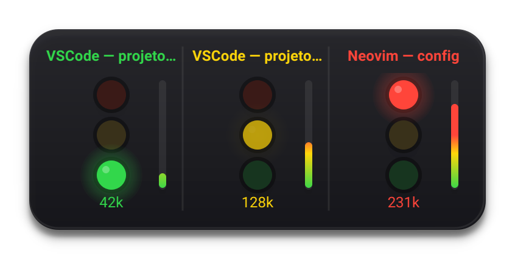
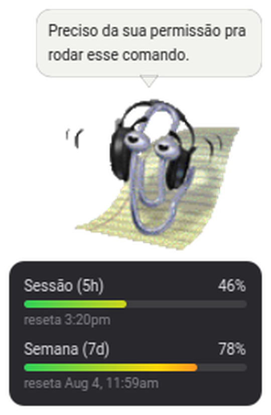

*Português | [English](README.en.md)*

# Semáforo de Status

Painel flutuante para Linux que monitora sessões de editores e agentes de IA em tempo real. Cada sessão vira uma coluna com um mini semáforo (🔴🟡🟢), e um mascote animado único resume o estado geral de tudo o que está rodando.

Integração pronta com **Claude Code**: basta instalar o hook e cada sessão vira uma coluna automaticamente, sem configuração por projeto.

<p align="center">
  
  &nbsp;&nbsp;
  
</p>

## Estados

| | Status | Significado |
|---|--------|-------------|
| 🟢 | **Verde** | Ocioso — aguardando comando |
| 🟡 | **Amarelo** (pulsando) | Processando / escrevendo código |
| 🔴 | **Vermelho** | Erro ou intervenção humana necessária |

O vermelho toca um alerta sonoro e dispara uma notificação de desktop na transição — mas fica em silêncio se você já estiver com aquela janela em foco (detecção via X11).

## Instalação

Requer Python 3.9+.

```bash
pip install -r requirements.txt
python3 main.py
```

Se o pip tentar compilar o PyQt6 e falhar (erro `qmake`), force as versões testadas:

```bash
pip install --user "PyQt6==6.6.1" "PyQt6-Qt6==6.6.3"
```

> Em algumas distribuições, instale antes `python3-dev` e `libgl1-mesa-dev`.

Um ícone aparece na bandeja do sistema assim que o app inicia. O painel só flutua na tela quando há pelo menos uma sessão ativa, e sua posição é lembrada entre execuções — arraste pela barra de título para mover.

Para abrir automaticamente no login (freedesktop.org, compatível com KDE/GNOME/XFCE):

```bash
python3 autostart.py install
```

## Integração com Claude Code

```bash
python3 hooks/install.py
```

Mescla os hooks do Semáforo em `~/.claude/settings.json` sem apagar configurações existentes. A partir daí, toda sessão do Claude Code (em qualquer projeto) vira uma coluna automaticamente, refletindo o ciclo de vida real da sessão:

| Evento do Claude Code | Status |
|---|---|
| Sessão iniciada / resposta completa | 🟢 idle |
| Comando enviado / ferramenta em uso | 🟡 working |
| Aguardando aprovação ou permissão | 🔴 error |
| Sessão encerrada | remove a coluna |

O balão de fala do mascote mostra um preview da última resposta quando uma sessão termina ou entra em erro. Se o projeto for movido ou renomeado, `main.py` detecta e reinstala os hooks sozinho a cada início — não é preciso rodar `hooks/install.py` de novo manualmente.

## O Mascote

Um mascote animado único (estilo MS Agent) representa o estado agregado de todas as sessões, com prioridade erro > processando > ocioso. Escolha o personagem em **Configurações → Mascote**:

<p align="center">
  
</p>

Clippy, Merlin, Rocky, Rover, Links, F1, Genius, Bonzi, Genie e Peedy. Assets originais do projeto [clippy.js](https://github.com/clippyjs/clippy.js) (sprites Microsoft redistribuídos pela comunidade sem licença clara — uso pessoal/local apenas).

## Configurações

Acesse pelo ícone da bandeja → **Configurações...** (persistidas em `~/.config/semaforo-status/config.yaml`).

| Opção | Efeito |
|-------|--------|
| Personagem | Qual mascote animar |
| Tamanho | Escala do mascote em pixels |
| Som | Sons de movimento e de alerta |
| Mostrar mascote | Painel completo (mascote + luzes) ou só as luzes |
| Beep / notificação de desktop | Alertas ao entrar em erro |
| Tempo de revezamento | Velocidade de rotação entre sessões |
| Tempo de mensagem | Duração do balão de fala |

Sessões `working`/`error` sem atualização por 10+ minutos voltam para `idle` (provável travamento); qualquer sessão parada por 4+ horas é removida. Sessões `idle` nunca são removidas por idade.

## Integrando outros editores/agentes

O protocolo é um arquivo JSON por sessão em `sessions/<session_id>.json`, monitorado em tempo real. Reporte via CLI:

```bash
python3 status_writer.py <id> <idle|working|error> --label "Nome" [--message "Texto do balão"]
```

```bash
python3 status_writer.py vscode-1 working --label "VSCode — Projeto A"
python3 status_writer.py vscode-1 idle    --label "VSCode — Projeto A" --message "✓ Código gerado"
python3 status_writer.py vscode-1 error   --label "VSCode — Projeto A" --message "⚠ Permissão recusada"
```

Cada `session_id` diferente vira uma coluna independente. Para compartilhar estado entre múltiplas instâncias do app, aponte todas para o mesmo diretório:

```bash
export SEMAFORO_STATUS_DIR=/tmp/semaforo-sessions
```

### Testar sem um agente real

```bash
python3 simulate.py
```

Cria 3 sessões fictícias alternando entre idle/working/error — útil para ver o painel e o mascote em ação antes de integrar de verdade.
